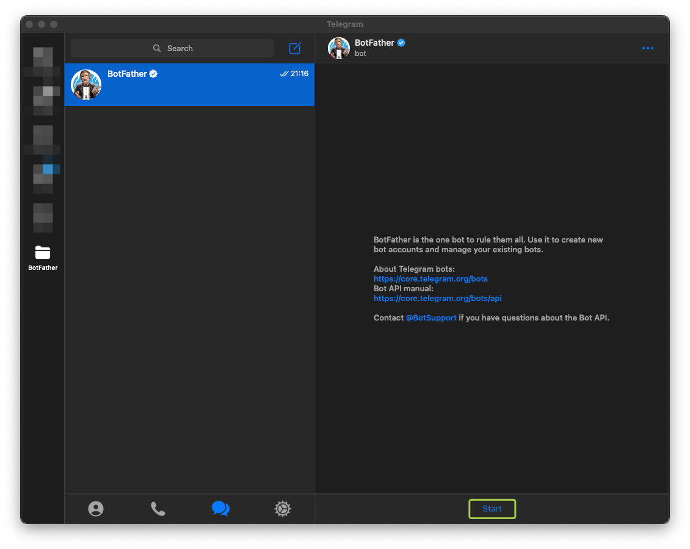
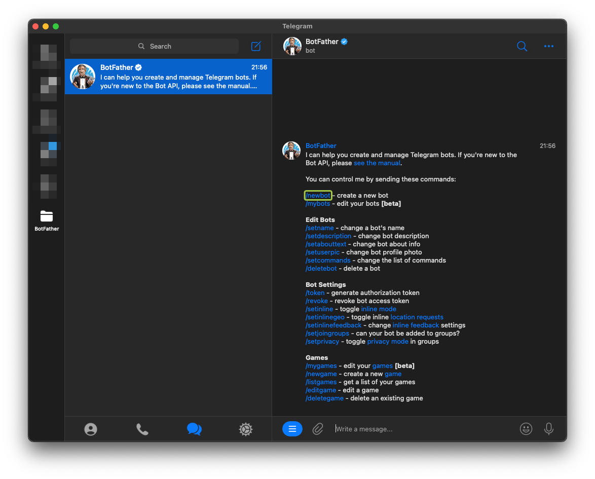
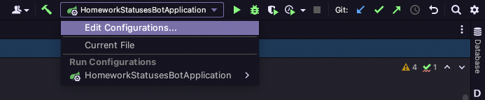
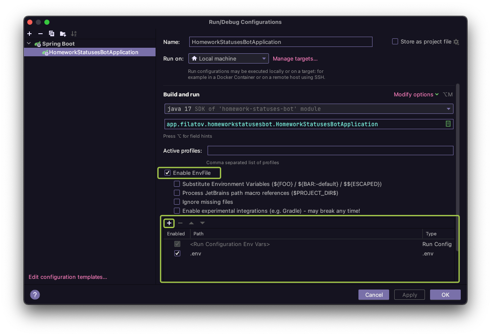
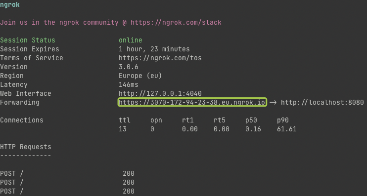

# Практикум.Домашка

Бот для отслеживания изменений статуса проверки домашней работы в Яндекс Практикуме

## Начало работы

### Регистрация нового бота

Регистрацию нового бота выполняет специальный бот: **[@BotFather]( https://t.me/BotFather)**.

Первое, что нужно сделать, это найти его и начать процесс создания собственного бота:


<br>


Далее нужно будет ввести имя бота (то, как он будет отображаться у пользователей) и username бота (служебное имя, на
английском и оно должно оканчиваться на Bot или bot, например _TetrisBot_ or _tetris_bot_)
Самое важное - это API Токен, который будет получен в конце этой процедуры. С его помощью происходит управление ботом и
публиковать его где-либо нельзя (можно будет сбросить его, если все же засветили)

### Подготовка к разработке

Далее необходимо скачать проект и внести в переменные среды следующие значения:

* BOT_USERNAME
* BOT_TOKEN
* BOT_PATH

Для этого необходимо создать .env файл (файл, в котором принято хранить секреты) и заполнить его следующим образом:

```shell
BOT_USERNAME=Имя бота
BOT_TOKEN=Токен бота
BOT_PATH=Адрес для получения обновлений бота
```

Если с первыми пунктами все должно быть понятно, то получение адреса для обновлений может вызывать вопросы. Об этом
будет в следующем разделе

Полученный файл нужно будет указать в настройках запуска проекта:


<br>


_Я почти уверен, что этот функционал входит в идею, а не добавлен плагином. Если это не так, пишите!_

## Получение адреса для обновлений бота

Вкратце о том, как бот получает новые сообщения. Есть два ~~стула~~ пути:

* Периодически опрашивать телеграм на наличие новых сообщений
* Сообщить телеграму свой адрес, куда следует писать, если появятся новые сообщения

Второй путь более правильный, мы пойдем именно им. Но для этого этот адрес нужно получить. К счастью, нигде
регистрироваться не нужно)
Есть отличная программа **[ngrok](https://ngrok.com)**. Ее необходимо установить и запустить:

```shell
ngrok http 8080
```


<br>

Выделенный адрес это как раз то, что нам нужно. Все что будет приходить на этот адрес, будет переадресовываться на
локальный компьютер (это можно использовать и для наших проектов практикума, если захочется показать как работает API).
И да, этот адрес дается на некоторое время, и через пару часов нужно будет получить новый адрес и поменять его в .env
файле.

Далее нужно сообщить телеграму о нашем адресе. Для этого через postman или просто в браузере нужно обратится по адресу

```shell
https://api.telegram.org/bot{API_KEY}/setWebhook?url={Полученный адрес}

example: https://api.telegram.org/bot5499967312:AAEpsdfxxfZOrElvJrRPR72IvI5LfTcc1LE/setWebhook?url=https://2070-172-94-23-38.eu.ngrok.io
```

В случае успеха в ответ придет следующее:

```json
{
  "ok": true,
  "result": true,
  "description": "Webhook was set"
}
```

Если все именно так, то можно запускать приложение и писать боту, если же нет, то искать ошибку)